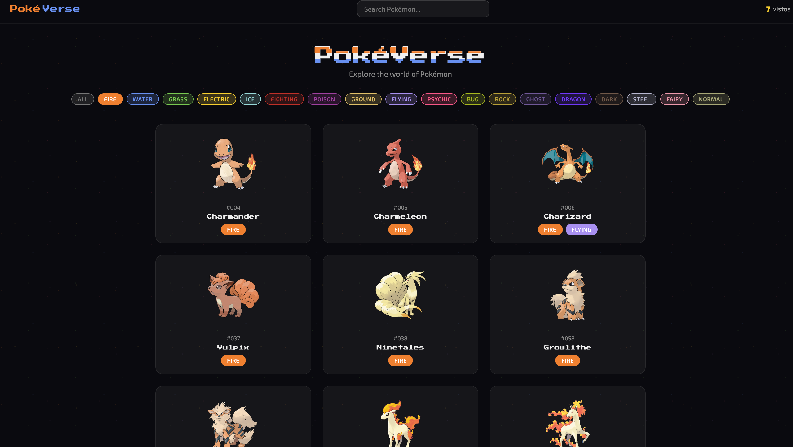

# PokéVerse

Aplicación full-stack que consume la [PokeAPI](https://pokeapi.co/) con un diseño retro-futurista oscuro. Permite explorar, buscar y filtrar Pokémon por tipo, ver estadísticas detalladas, cadenas evolutivas y gestionar favoritos — todo con una interfaz temática cyberpunk.



---

## Tabla de contenido

- [Arquitectura](#arquitectura)
- [Stack tecnológico](#stack-tecnológico)
- [Estructura del proyecto](#estructura-del-proyecto)
- [Requisitos previos](#requisitos-previos)
- [Inicio rápido con Docker Compose](#inicio-rápido-con-docker-compose)
- [Desarrollo local sin Docker](#desarrollo-local-sin-docker)
- [Variables de entorno](#variables-de-entorno)
- [API — Endpoints del Backend](#api--endpoints-del-backend)
- [Funcionamiento interno](#funcionamiento-interno)
- [Frontend — Características](#frontend--características)
- [Dockerfiles — Multi-stage builds](#dockerfiles--multi-stage-builds)

---

## Arquitectura

La aplicación sigue un patrón **BFF (Backend For Frontend)**. El frontend nunca se comunica directamente con la PokeAPI externa; en su lugar, el backend actúa como intermediario, agrega datos y cachea las respuestas.

```
┌─────────────────────────────────────────────────┐
│                   Browser                       │
│                 localhost:3000                   │
└──────────────────────┬──────────────────────────┘
                       │ HTTP
              ┌────────▼────────┐
              │    Frontend     │
              │  React + Vite   │
              │  (nginx :80)    │  ← sirve estáticos + reverse proxy
              └────────┬────────┘
                       │ /api/*  /health
              ┌────────▼────────┐
              │    Backend      │
              │    FastAPI      │
              │ (uvicorn :8000) │  ← BFF con cache en memoria
              └────────┬────────┘
                       │ HTTPS
              ┌────────▼────────┐
              │    PokeAPI      │
              │   (external)    │
              └─────────────────┘
```

**Flujo de una petición típica:**

1. El navegador solicita `localhost:3000/api/pokemon?page=1&limit=20`.
2. Nginx recibe la petición y, al detectar el prefijo `/api/`, la redirige (proxy) al backend en `backend:8000`.
3. FastAPI verifica si existe una respuesta cacheada (TTLCache en memoria) para esa ruta.
4. Si no hay cache, realiza una petición HTTP asíncrona (httpx) a `pokeapi.co`, parsea el resultado, lo almacena en cache y lo devuelve.
5. El frontend renderiza los datos con React.

---

## Stack tecnológico

| Capa | Tecnología | Versión |
|------|-----------|---------|
| **Frontend** | React + Vite + TypeScript | React 18 · Vite 6 · TS 5.6 |
| **Routing (client)** | React Router DOM | v6.28 |
| **Estado global** | Zustand (persist) | v5 |
| **Data fetching** | TanStack React Query | v5.62 |
| **HTTP client (front)** | Axios | v1.7 |
| **Gráficos** | Recharts | v2.15 |
| **Backend** | FastAPI + Uvicorn | FastAPI 0.115 · Python 3.12 |
| **HTTP client (back)** | httpx (async) | v0.28 |
| **Cache** | cachetools (TTLCache) | v5.5 |
| **Validación** | Pydantic + pydantic-settings | v2.10 |
| **Servidor web** | Nginx (Alpine) | última estable |
| **Contenedores** | Docker + Docker Compose | — |

---

## Estructura del proyecto

```
devops-pokedex/
├── docker-compose.yml          # Orquestación de servicios
├── README.md
│
├── backend/                    # API FastAPI (BFF)
│   ├── Dockerfile              # Multi-stage build (Python 3.12-alpine)
│   ├── main.py                 # Punto de entrada — FastAPI app
│   ├── requirements.txt        # Dependencias Python
│   ├── core/
│   │   └── config.py           # Settings con pydantic-settings (env vars)
│   ├── models/
│   │   └── schemas.py          # Modelos Pydantic (request/response)
│   ├── routers/
│   │   ├── pokemon.py          # Endpoints: listar, detalle, evolución, búsqueda
│   │   └── types.py            # Endpoint: listar tipos
│   └── services/
│       ├── cache_service.py    # Cache en memoria con TTLCache
│       └── pokeapi_client.py   # Cliente HTTP async hacia PokeAPI
│
├── frontend/                   # SPA React
│   ├── Dockerfile              # Multi-stage build (Node 20 → Nginx)
│   ├── nginx.conf              # Reverse proxy + gzip + cache estáticos
│   ├── package.json
│   ├── tsconfig.json
│   ├── vite.config.ts          # Config Vite + proxy de desarrollo
│   └── src/
│       ├── App.tsx             # Router principal
│       ├── main.tsx            # Punto de entrada React
│       ├── api/
│       │   ├── client.ts       # Instancia Axios base
│       │   └── pokemon.ts      # Funciones fetch tipadas
│       ├── components/         # Componentes reutilizables
│       │   ├── ErrorBoundary   # Captura errores de render
│       │   ├── FilterBar       # Filtro por tipo de Pokémon
│       │   ├── LoadingPokeball # Spinner animado
│       │   ├── Navbar          # Barra de navegación
│       │   ├── PokemonCard     # Tarjeta de Pokémon
│       │   ├── SearchBar       # Barra de búsqueda
│       │   └── TypeBadge       # Badge de tipo con color
│       ├── hooks/              # Custom hooks
│       │   ├── usePokemons.ts  # Lista paginada + filtro
│       │   ├── usePokemonDetail.ts
│       │   └── useTypes.ts     # Lista de tipos
│       ├── pages/
│       │   ├── HomePage        # Grilla + paginación + filtro
│       │   └── PokemonDetailPage # Vista detallada + stats + evolución
│       ├── store/
│       │   └── useAppStore.ts  # Zustand: favoritos, recientes, tipo seleccionado
│       ├── styles/
│       │   └── global.css      # Estilos globales
│       ├── types/
│       │   └── pokemon.ts      # Interfaces TypeScript
│       └── utils/
│           └── helpers.ts      # Utilidades
│
└── docs/
    └── images/                 # Screenshots de la UI
```

---

## Requisitos previos

- **Docker** ≥ 20.10 y **Docker Compose** v2+
- *(Opcional para desarrollo local sin Docker):* **Node.js** ≥ 20, **Python** ≥ 3.12

---

## Inicio rápido con Docker Compose

```bash
# Clonar el repositorio
git clone <URL_DEL_REPO>
cd devops-pokedex

# Construir y levantar ambos servicios
docker compose up --build
```

Una vez arriba:

| Servicio | URL |
|----------|-----|
| Frontend (UI) | http://localhost:3000 |
| Backend API | http://localhost:8000 |
| API Docs (Swagger) | http://localhost:8000/docs |
| API Docs (ReDoc) | http://localhost:8000/redoc |

Para detener:

```bash
docker compose down
```

### ¿Qué hace Docker Compose?

1. **backend**: Construye la imagen Python 3.12-alpine, instala dependencias, y ejecuta Uvicorn con la cantidad de workers configurada. Incluye un healthcheck que verifica `/health`.
2. **frontend**: Construye la app React con Vite, copia los estáticos a Nginx. Nginx actúa como servidor web y reverse proxy hacia el backend.
3. El frontend **depende** del backend (`depends_on` con `condition: service_healthy`), por lo que no arranca hasta que el backend responda correctamente al healthcheck.
4. Ambos servicios viven en una red Docker Bridge privada (`pokeverse`).

---

## Desarrollo local sin Docker

### Backend

```bash
cd backend

# Crear entorno virtual
python3 -m venv .venv
source .venv/bin/activate

# Instalar dependencias
pip install -r requirements.txt

# Ejecutar el servidor
uvicorn main:app --host 0.0.0.0 --port 8000 --reload
```

### Frontend

```bash
cd frontend

# Instalar dependencias
npm install

# Ejecutar en modo desarrollo (Vite)
npm run dev
```

Vite proxifica automáticamente las peticiones `/api/*` y `/health` al backend en `localhost:8000` (configurado en `vite.config.ts`), por lo que el frontend funciona transparentemente tanto en desarrollo como en producción.

---

## Variables de entorno

El backend lee sus variables de entorno mediante `pydantic-settings` (clase `Settings` en `core/config.py`). También soporta un archivo `.env` en la raíz del backend.

| Variable | Default | Descripción |
|----------|---------|-------------|
| `POKEAPI_BASE_URL` | `https://pokeapi.co/api/v2` | URL base de la PokeAPI externa |
| `CACHE_TTL` | `300` | Tiempo de vida del cache en segundos (5 min) |
| `WORKERS` | `2` | Número de workers de Uvicorn (procesos) |
| `CORS_ORIGINS` | `["*"]` | Lista de orígenes CORS permitidos |

En `docker-compose.yml` las variables se setean en la sección `environment` del servicio `backend`:

```yaml
environment:
  - POKEAPI_BASE_URL=https://pokeapi.co/api/v2
  - CACHE_TTL=300
  - WORKERS=2
```

---

## API — Endpoints del Backend

Todos los endpoints son asíncronos y la documentación interactiva está en `/docs` (Swagger UI) o `/redoc`.

### Pokémon

| Método | Ruta | Parámetros | Descripción |
|--------|------|------------|-------------|
| `GET` | `/api/pokemon` | `page` (default 1), `limit` (default 20, max 100), `type` (opcional) | Lista paginada de Pokémon. Si se pasa `type`, filtra por tipo. |
| `GET` | `/api/pokemon/{name_or_id}` | — | Detalle completo de un Pokémon: stats, habilidades, peso, altura y cadena evolutiva. |
| `GET` | `/api/pokemon/{name}/evolution` | — | Cadena evolutiva del Pokémon (lista de nodos con nombre, nivel y trigger). |
| `GET` | `/api/search` | `q` (requerido, min 1 char), `limit` (default 10, max 50) | Búsqueda de Pokémon por nombre (coincidencia parcial). |

### Tipos

| Método | Ruta | Descripción |
|--------|------|-------------|
| `GET` | `/api/types` | Lista todos los tipos de Pokémon con su color hex y relaciones de daño. |

### Sistema

| Método | Ruta | Descripción |
|--------|------|-------------|
| `GET` | `/health` | Health check — devuelve `{"status": "ok"}`. |

### Ejemplos de respuesta

**`GET /api/pokemon?page=1&limit=2`**
```json
{
  "items": [
    {
      "id": 1,
      "name": "bulbasaur",
      "types": ["grass", "poison"],
      "sprite_url": "https://raw.githubusercontent.com/.../1.png",
      "base_experience": 64
    },
    {
      "id": 2,
      "name": "ivysaur",
      "types": ["grass", "poison"],
      "sprite_url": "https://raw.githubusercontent.com/.../2.png",
      "base_experience": 142
    }
  ],
  "total": 1302,
  "page": 1,
  "limit": 2,
  "pages": 651
}
```

**`GET /api/pokemon/pikachu`**
```json
{
  "id": 25,
  "name": "pikachu",
  "types": ["electric"],
  "sprite_url": "https://raw.githubusercontent.com/.../25.png",
  "base_experience": 112,
  "stats": [
    { "name": "hp", "value": 35 },
    { "name": "attack", "value": 55 },
    { "name": "defense", "value": 40 },
    { "name": "special-attack", "value": 50 },
    { "name": "special-defense", "value": 50 },
    { "name": "speed", "value": 90 }
  ],
  "abilities": [
    { "name": "static", "is_hidden": false },
    { "name": "lightning-rod", "is_hidden": true }
  ],
  "height": 4,
  "weight": 60,
  "evolution_chain": [
    { "name": "pichu", "level": null, "trigger": "level-up", "sprite_url": "..." },
    { "name": "pikachu", "level": null, "trigger": "level-up", "sprite_url": "..." },
    { "name": "raichu", "level": null, "trigger": "use-item", "sprite_url": "..." }
  ]
}
```

---

## Funcionamiento interno

### Backend — Capa de servicios

```
routers/ ──→ services/pokeapi_client.py ──→ PokeAPI (externa)
                     │
                     └──→ services/cache_service.py (TTLCache en memoria)
```

- **`pokeapi_client.py`**: Cliente HTTP asíncrono (httpx) que implementa toda la lógica de comunicación con la PokeAPI. Mantiene una única instancia de `httpx.AsyncClient` (singleton) con timeout configurable. Cada petición pasa primero por el cache; si hay miss, se realiza la petición, se parsean los datos y se almacenan antes de devolver.
- **`cache_service.py`**: Wrapper simple sobre `cachetools.TTLCache` con capacidad para 1024 entradas y TTL configurable. Reduce drásticamente las llamadas a la API externa.
- **`schemas.py`**: Define modelos Pydantic estrictos (`PokemonSummary`, `PokemonDetail`, `Stat`, `Ability`, `EvolutionNode`, `TypeInfo`, `DamageRelations`, `PaginatedResponse`) que validan automáticamente las respuestas de los endpoints.
- **Manejo de errores**: Si la PokeAPI no responde devuelve HTTP 503; si el recurso no existe, HTTP 404; si responde con error, HTTP 502.

### Frontend — Flujo de datos

```
Componentes (React) ─→ Custom Hooks ─→ API Functions ─→ Axios ─→ /api/* ─→ Backend
         ↑                   ↑
         │                   └── TanStack Query (cache, refetch, staleTime)
         └── Zustand Store (favoritos, recientes, tipo seleccionado)
```

- **TanStack React Query**: Maneja el fetching asíncrono con cache en cliente (`staleTime: 5min`), reintento automático y `placeholderData` para transiciones suaves entre páginas.
- **Zustand** (con `persist`): Almacena en `localStorage` los Pokémon favoritos, los vistos recientemente y el tipo seleccionado para filtrar. Persiste entre sesiones del navegador.
- **Prefetch**: Al hacer hover sobre una tarjeta de Pokémon, se dispara un `prefetchQuery` para que al hacer click el detalle se cargue instantáneamente.
- **ErrorBoundary**: Captura errores de renderizado de React y muestra un fallback amigable en vez de crashear toda la app.

### Nginx — Reverse proxy y optimización

El archivo `nginx.conf` configura:

- **Reverse proxy**: Las rutas `/api/*` y `/health` se redirigen al backend (`http://backend:8000`).
- **SPA fallback**: Cualquier otra ruta devuelve `index.html` para que React Router maneje el routing del lado del cliente.
- **Compresión gzip**: Activada para JSON, JS, CSS, SVG y otros tipos de contenido (nivel 6).
- **Cache de assets estáticos**: Archivos `.js`, `.css`, imágenes y fuentes se cachean 7 días con `Cache-Control: public, immutable`.

---

## Frontend — Características

| Característica | Descripción |
|---------------|-------------|
| **Grilla de Pokémon** | Tarjetas con imagen, nombre, tipos y experiencia base. Animación escalonada de aparición. |
| **Paginación** | Navegación por páginas con indicador de página actual / total. |
| **Filtro por tipo** | Barra de filtros con badges de colores por cada tipo de Pokémon. |
| **Búsqueda** | Búsqueda en tiempo real por nombre. |
| **Vista detalle** | Estadísticas (stats), habilidades, altura, peso y cadena evolutiva completa. |
| **Favoritos** | Toggle de favoritos persistido en localStorage vía Zustand. |
| **Vistos recientemente** | Historial de los últimos 20 Pokémon visitados. |
| **Prefetch on hover** | Al pasar el mouse sobre una tarjeta, se precarga el detalle para navegación instantánea. |
| **Error Boundary** | Captura errores de rendering y muestra un fallback amigable. |
| **Diseño responsive** | UI retro-futurista oscura adaptable a distintos tamaños de pantalla. |

---

## Dockerfiles — Multi-stage builds

Ambos Dockerfiles usan **multi-stage builds** para reducir el tamaño de las imágenes finales:

### Backend (`backend/Dockerfile`)

| Stage | Base | Función |
|-------|------|---------|
| `builder` | `python:3.12-alpine` | Instala dependencias con pip en un directorio aislado (`/install`) |
| Runtime | `python:3.12-alpine` | Copia solo los paquetes instalados + código fuente. Crea un usuario `appuser` sin privilegios. |

### Frontend (`frontend/Dockerfile`)

| Stage | Base | Función |
|-------|------|---------|
| `builder` | `node:20-alpine` | Instala dependencias npm y ejecuta `npm run build` (TypeScript + Vite) |
| Runtime | `nginx:alpine` | Solo copia los archivos estáticos generados (`dist/`) y la configuración Nginx. |

---

## 📄 Licencia

Este proyecto está licenciado bajo **MIT License** — ver el archivo [LICENSE](LICENSE) para detalles.

---

## 👨‍💻 Autor

**roxsross** — Instructor DevOps y Cloud

[](https://twitter.com/roxsross)
[](https://linkedin.com/in/roxsross)
[](https://ko-fi.com/roxsross)
[](https://youtube.com/@295devops)
[](mailto:roxs@295devops.com)

---

> ⭐ **¡Dale una estrella si este proyecto te ayudó!** ⭐

> 💡 **Tip:** Este proyecto está diseñado para fines educativos. Úsalo para aprender DevOps, contenedores y monitoreo.

